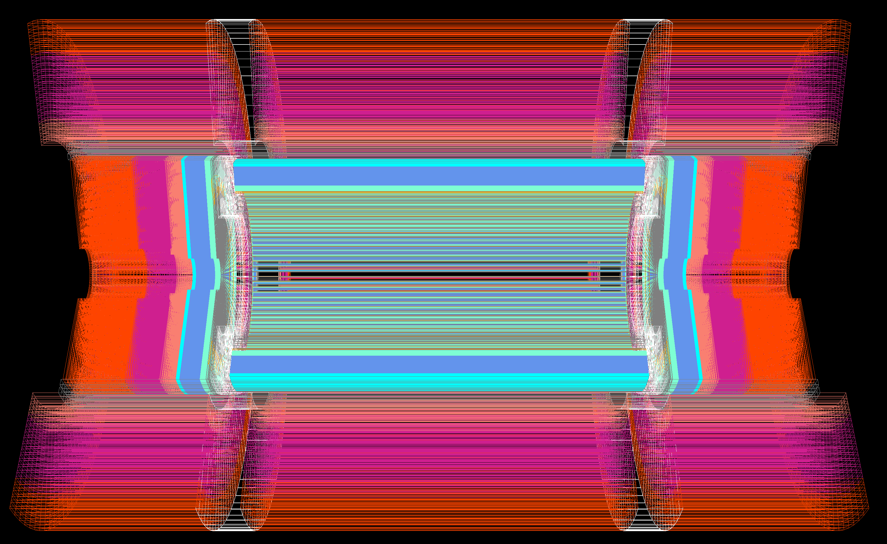
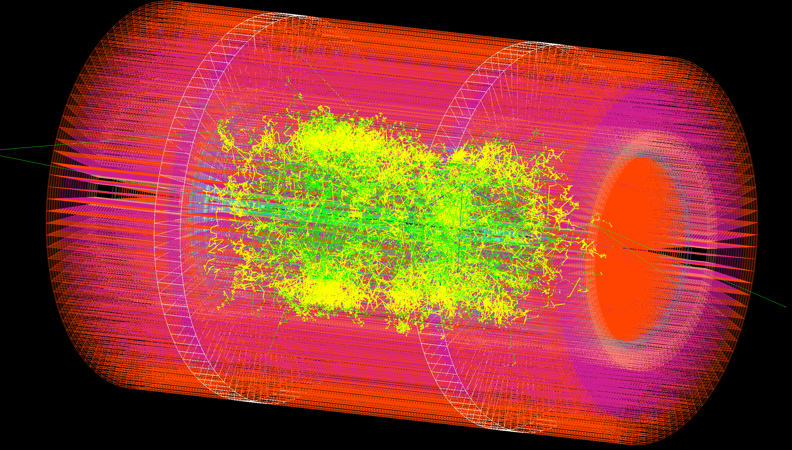

# Lorenzetti Simulator 

Lorenzetti is a framework for the HEP community to freely exploit the full potential of calorimetry data. We expect to enable the community to mitigate bottlenecks for R&D in processing algorithms using calorimetry data by providing:

 - Unified low-level calorimetry and physics information based on full simulation (geant);
 - Free-to-use data. 
 
In other words, it provides a way for the HEP community to work on proof-of-concepts (POCs) using simulated data that is currently difficult to obtain on experiments and to publish them independently. We believe that this possibility, i.e. to publish POCs apart from the experiments, can be a powerful way to foster scientific exchange within the HEP community, but also to facilitate the exchange of processing algorithms with the broader scientific community.

We welcome everyone to contribute!

## 🧪 CI Status

| Test Job | Target | Status |
| :--- | :--- | :--- |
| **Core Build** | Compilation & Install |  |
| **Reco Sequence** | Full Event Chain |  |
| **Anomaly Sequence** | Anomaly Injection |  |
| **Gen Zee** | Zee Generator |  |
| **Gen Jets** | Jets Generator |  |
| **Gen Minbias** | Minbias Generator |  |
| **Gen Single** | Single Particle |  |
| **Gen Overlapped** | Overlapped Zee |  |
| **Documentation** | GitHub Pages |  |

## Citations

Please cite  if you use the software.

[//]: # (and/or the applicable papers.)

## Manual:

- [Installation](docs/installation.md)
- [Usage](docs/usage.html)
- [Particle Generators](docs/generation.html)
- [Anomaly Injection Tutorial](docs/anomaly.html)

## Web Pages:

 - [WebPage](https://sites.google.com/lps.ufrj.br/lorenzetti/início?authuser=0)
 - [DocPage](https://lorenzetti-ufrj-br.github.io/lorenzetti/)

## Detector Construction (version 1):

The standard detector in the Lorenzetti framework consist in a eletromagnetic calorimeter and a hadronic calorimeter using a cylinder shape. Each one has 3 layers with different granularities to capture the shower develop by the particles. Also, between regions, there is a small slice of dead material.

It is possible, by using Geant4 modules to change the geometry, the layers and the cell granularity, allowing a high level of customization of the full detector.

## Software considerations:

Lorenzetti is built on top of standard simulation technology employed on HEP experiments ([Pythia](http://home.thep.lu.se/~torbjorn/Pythia.html) and [Geant](https://geant4.web.cern.ch)). Lorenzetti's concept design was greatly inspired in the [Athena framework](https://gitlab.cern.ch/atlas/athena). Other frameworks of potential interest:

- [FCC software](https://github.com/HEP-FCC/FCCSW). Particularly, we consider to eventually merge Lorenzetti inside the FCC software;
- [Delphes](https://github.com/delphes/delphes).
